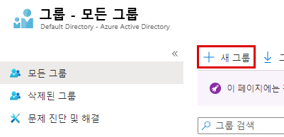
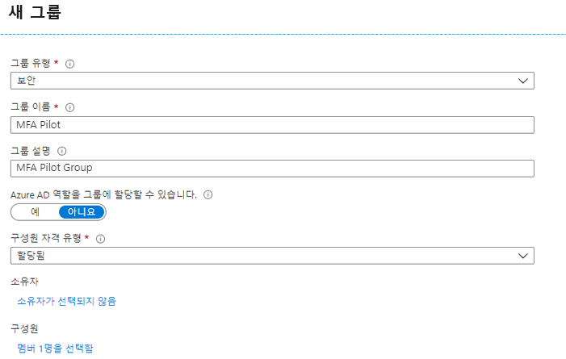

# 모듈 3 - 랩 1 - 연습 3 - MFA 조건부 액세스(Azure Multi-Factor Authentication 파일럿 출시 완료)

이 연습에서는 Azure Portal에 로그인할 때 Azure MFA(Multi-Factor Authentication)를 사용하도록 설정하는 조건부 액세스 정책을 구성합니다. 이 정책은 특정 파일럿 사용자 그룹에 배포되며, 해당 그룹을 대상으로 정책 테스트가 진행됩니다. 조건부 액세스를 사용하여 Azure MFA를 배포하면 기존에 적용했던 방법에 비해 조직과 관리자가 배포 과정을 매우 유동적으로 제어할 수 있습니다.

- Azure Multi-Factor Authentication을 사용하도록 설정
- Azure Multi-Factor Authentication 테스트

### 작업 1: Azure Multi-Factor Authentication을 사용하도록 설정

1.  전역 관리자인 Holly Dickson으로 로그인되어 있는 Azure Portal로 돌아옵니다.

1.  허브에서 **Azure Active Directory**로 이동합니다.

1.  **그룹**, **+ 새 그룹**을 차례로 클릭합니다.

     

1.  다음 정보를 입력하고 **만들기**를 선택합니다.

      * 그룹 유형: `Security`
      * 그룹 이름: `MFA Pilot`
      * 그룹 설명: `MFA Pilot Group`
      * 구성원 유형: `Assigned`
      * 구성원: `Lynne Robbins` 선택
  
  
      
  
2.  **Azure Active Directory**로 이동하여 **보안**을 클릭하고 **정책** 블레이드에서 **조건부 액세스**를 선택합니다.

3.  **+ 새 정책**을 선택합니다.

4.  정책 이름을 `MFA Pilot`으로 지정합니다.
5.  **사용자 및 그룹** 아래에서 **0명의 사용자 및 그룹이 선택됨**을 선택합니다. **사용자 및 그룹 선택** 라디오 단추를 선택하고 **사용자 및 그룹** 상자를 선택합니다.
    * 파일럿 그룹 `MFA Pilot`을 선택합니다.
    * **선택**을 클릭합니다.

6.  **클라우드 앱 또는 작업**을 클릭하고 **앱 선택** 라디오 단추를 선택합니다.
    * **선택**을 클릭합니다. Azure Portal용 클라우드 앱인 `Microsoft Azure Management`를 선택합니다.
    * **선택**을 클릭합니다.

7.  **조건** 섹션은 건너뜁니다.
8.  **허용**을 클릭하여 **액세스 허용** 라디오 단추가 선택되어 있는지 확인합니다.
    * **다단계 인증 필요** 확인란을 선택합니다.
    * **선택**을 클릭합니다.

9.  **세션** 섹션은 건너뜁니다.
10. **정책 사용** 토글을 **켜기**로 설정합니다.
11. **만들기**를 클릭합니다.

    **참고**: 정책 적용이 실패하면 작업 내용을 확인하고 만들기를 다시 클릭합니다. 

### 작업 2: Azure Multi-Factor Authentication 테스트

조건부 액세스 정책이 작동함을 확인하기 위해 MFA가 필요하지 않은 리소스에 테스트 로그인한 다음 MFA가 필요한 Azure Portal에 로그인합니다.

2.  InPrivate 또는 시크릿 모드에서 새 브라우저 창을 열고 **`https://portal.azure.com`** 으로 이동합니다.

       * Lynne Robbins 사용자로 로그인합니다(Lynne의 암호는 랩 호스팅 공급자가 제공한 MOD 관리자 암호와 동일할 가능성이 높음). 그런 다음 이제는 Azure Multi-Factor Authentication에 등록하고 MFA를 사용해야 함을 확인합니다.
       * 브라우저 창을 닫습니다.

# 랩 종료
